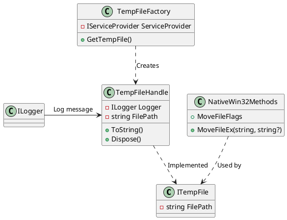

# Temp File Factory Documentation

## Overview

The Temp File Factory is a .NET library responsible for creating and managing temporary files. It consists of three main components: `NativeWin32Methods`, `TempFileFactory`, and `TempFileHandle`.

## Components

### `NativeWin32Methods`

`NativeWin32Methods` is a static class responsible for providing native Win32 methods for file operations. It contains two main methods:

* `MoveFileEx`: moves a file to a new location, with optional flags for file merge, delay until reboot, and more.
* `MoveFileFlags`: an enum defining the possible flags for the `MoveFileEx` method.

### `TempFileFactory`

`TempFileFactory` is a class responsible for creating instances of the `TempFileHandle` class. It has one main method:

* `GetTempFile`: creates a new temporary file and returns an instance of `TempFileHandle`.

### `TempFileHandle`

`TempFileHandle` is a class responsible for managing a temporary file. It has the following properties:

* `FilePath`: the path of the temporary file.
* `Logger`: an instance of `ILogger` used for logging operations.

`TempFileHandle` has the following methods:

* `ToString`: returns the path of the temporary file.
* `Dispose`: releases the resources used by the temporary file.

## Sequence Diagram

```plantuml
@startuml
interface ITempFile
participant "TempFileHandle" as TFH
participant "NativeWin32Methods" as NM
participant "TempFileFactory" as TF
participant "ILogger" as ILG

note TFH
  Creates a temporary file
end note

note NM
  Moves file to new location
end note

TF -> TFH: Create temporary file
TFH -> ILG: Log operation
ILG -> TFH: Log message

note "File operations" TFH
  Get file path
  Delete file
end note

@enduml
```

## Class Diagram



## Component Model

The Temp File Factory consists of three main components:

* `TempFileFactory`: an instance of this class creates and manages temporary files.
* `TempFileHandle`: an instance of this class represents a temporary file and provides methods for managing it.
* `NativeWin32Methods`: a static class providing native Win32 methods for file operations.

These components interact with each other as follows:

* `TempFileFactory` creates an instance of `TempFileHandle`.
* `TempFileHandle` uses `NativeWin32Methods` to move the temporary file to a new location and delete it.
* `ILogger` is used by `TempFileHandle` to log operations.