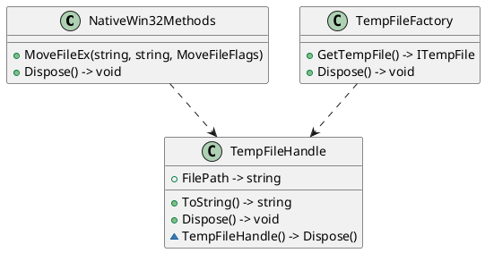

**README**

This project provides a set of classes for managing temporary files on a Windows system. The main functionality is implemented in three files:

1. `NativeWin32Methods.cs`: This file defines a set of native Win32 functions that can be used to manage files. It includes a wrapper around the `MoveFileEx` function, which can be used to delete a file after a reboot.
2. `TempFileFactory.cs`: This file defines a factory for creating instances of `TempFileHandle` objects. It uses the Microsoft.Extensions.DependencyInjection library to create a new instance of `TempFileHandle`.
3. **TempFileHandle.cs**: This file defines a `TempFileHandle` class that represents a handle for managing temporary files. It provides methods for getting the path of the temporary file, releasing resources used by the file, and deleting the file when it is no longer needed.

**Technical Summary**

The `NativeWin32Methods` class uses the `DllImport` attribute to call native Win32 functions. This is an example of a **platform invoke** design pattern, which allows managed code to call unmanaged code.

The `TempFileFactory` class uses the Microsoft.Extensions.DependencyInjection library to create instances of `TempFileHandle` objects. This is an example of an **inversion of control** design pattern, which allows the dependency on the logger and service provider to be injected.

The `TempFileHandle` class uses the ** destructor** (or finalizer) to release resources used by the file. This is an example of a **RAII** (Resource Acquisition Is Initialization) design pattern, which ensures that resources are released when they are no longer needed.

**Component Diagram**

This component diagram shows the relationships between the classes in the system. The `NativeWin32Methods` class provides the `MoveFileEx` function, which is used by the `TempFileHandle` class to delete the file when it is no longer needed. The `TempFileFactory` class creates instances of `TempFileHandle` objects and provides a way to get a new temporary file. The `TempFileHandle` class represents a handle for managing temporary files, and provides methods for getting the path of the file, releasing resources used by the file, and deleting the file when it is no longer needed.