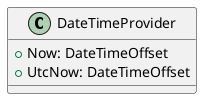
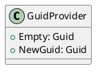
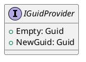
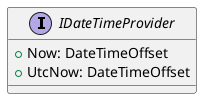

Here is the documentation for the given source code files:

**DateTimeProvider.cs**

**Class Diagram:**

**Class Documentation:**

The `DateTimeProvider` class is a simple provider class that provides date and time functionality. It implements the `IDateTimeProvider` interface and provides two properties: `Now` and `UtcNow`.

* `Now`: This property returns the current local date and time.
* `UtcNow`: This property returns the current Coordinated Universal Time (UTC) date and time.

**GuidProvider.cs**

**Class Diagram:**

**Class Documentation:**

The `GuidProvider` class is a provider class that represents a provider for generating and handling GUIDs. It implements the `IGuidProvider` interface and provides two properties: `Empty` and `NewGuid`.

* `Empty`: This property returns a GUID with all bits set to zero.
* `NewGuid`: This method generates a new GUID.

**IGuidProvider Interface**

**Interface Documentation:**

The `IGuidProvider` interface defines two methods: `Empty` and `NewGuid`. These methods are used to return or generate GUIDs.

* `Empty`: This method returns a GUID with all bits set to zero.
* `NewGuid`: This method generates a new GUID.

**IDateTimeProvider Interface**

**Interface Documentation:**

The `IDateTimeProvider` interface defines two properties: `Now` and `UtcNow`. These properties are used to return the current date and time.

* `Now`: This property returns the current local date and time.
* `UtcNow`: This property returns the current Coordinated Universal Time (UTC) date and time.

Note: The diagrams are generated using PlantUML, a simple and intuitive language for creating UML diagrams. The diagrams above represent a simple class diagram for each class, showing the properties and methods of each class.