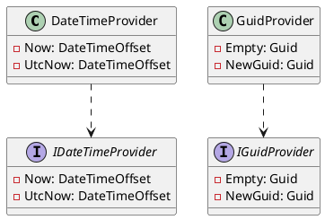

**README**

This repository contains two source files, `DateTimeProvider.cs` and `GuidProvider.cs`, which provide date and time, and GUID functionality respectively. These providers adhere to the interface-based programming paradigm and are designed to be easily extensible and reusable in different applications.

**Technical Summary**

The `DateTimeProvider` class implements the `IDateTimeProvider` interface and provides two properties, `Now` and `UtcNow`, which return the current local date and time and Coordinated Universal Time (UTC) date and time respectively. The `GuidProvider` class implements the `IGuidProvider` interface and provides two properties, `Empty` and `NewGuid`, which return an empty GUID and a new GUID respectively.

**Design Patterns and Architectural Patterns**

The `DateTimeProvider` and `GuidProvider` classes utilize the **Strategy** design pattern, as they encapsulate the different strategies for getting and generating dates and GUIDs. This allows for easy switching between different implementations and makes the code more flexible and maintainable.

The **Interface-based Programming** paradigm is also implemented, as the provider classes adhere to interfaces (`IDateTimeProvider` and `IGuidProvider`) defining the contracts for the date and GUID functionality.

**Component Diagram**

