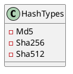
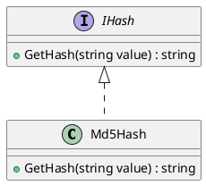
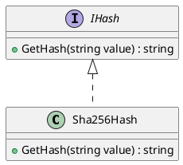
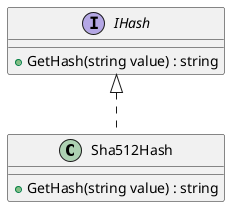
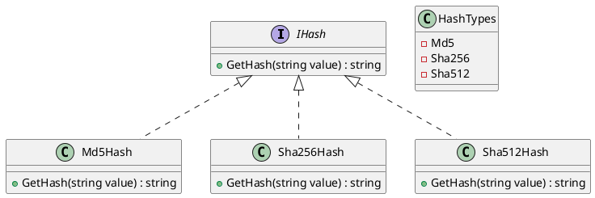

Here is the documentation for the provided source code files, including class diagrams in PlantUML:

**HashTypes.cs**

Class Diagram:

Description: `HashTypes` is an enumeration that specifies different types of hash algorithms. It contains three members: `Md5`, `Sha256`, and `Sha512`.

**Md5Hash.cs**

Class Diagram:

Description: `Md5Hash` is a class that implements the `IHash` interface. It has a single method `GetHash` that computes the default hash of the input value using the MD5 algorithm and returns the Base64 encoded hash as a string.

**Sha256Hash.cs**

Class Diagram:

Description: `Sha256Hash` is a class that implements the `IHash` interface. It has a single method `GetHash` that computes the default hash of the input value using the SHA256 algorithm and returns the Base64 encoded hash as a string.

**Sha512Hash.cs**

Class Diagram:

Description: `Sha512Hash` is a class that implements the `IHash` interface. It has a single method `GetHash` that computes the default hash of the input value using the SHA512 algorithm and returns the Base64 encoded hash as a string.

**Interfaces and Classes Hierarchy**

Class Diagram:

Description: The above class diagram shows the hierarchy of classes and interfaces. `IHash` is an interface that defines a single method `GetHash`. `HashTypes` is an enumeration that specifies different hash algorithms. `Md5Hash`, `Sha256Hash`, and `Sha512Hash` are classes that implement the `IHash` interface, each providing a specific hash algorithm.