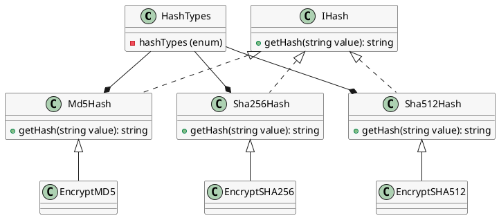

**Readme File**

**Summary**

The files provided contain a set of classes and an enumeration that provide a simple implementation of hash algorithms using the .NET base class library. The `HashTypes` enum defines three types of hash algorithms: MD5, SHA-256, and SHA-512. Each of the `Md5Hash`, `Sha256Hash`, and `Sha512Hash` classes implements the `IHash` interface, which provides a method to compute the hash of an input string using the respective algorithm.

**Technical Summary**

The implementation uses the `System.Security.Cryptography` namespace to utilize the built-in hash algorithms provided by .NET. The classes inherit from the `IHash` interface, which defines a single method `GetHash` that takes a string input and returns the Base64 encoded hash of the input value. The hash algorithms are computed using the `MD5`, `SHA256`, and `SHA512` classes, respectively.

The `Md5Hash`, `Sha256Hash`, and `Sha512Hash` classes use the `Encodings.UTF8.GetBytes` method to convert the input string to a byte array, and then use the respective hash algorithm to compute the hash. The resulting hash is then converted to a Base64 string using the `Convert.ToBase64String` method.

**Component Diagram**

