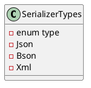

# Eliassen.System.Text - SerializerTypes

## Overview

The `Eliassen.System.Text` namespace contains a single enum class called `SerializerTypes`, which specifies different types of serialization formats.

## Class Diagram



## Description

The `SerializerTypes` enum class defines three constants that represent different serialization formats:

* `Json`: Represents the JSON serialization format.
* `Bson`: Represents the BSON (Binary JSON) serialization format.
* `Xml`: Represents the XML serialization format.

## Usage

The `SerializerTypes` enum class can be used in code to specify the desired serialization format. For example:
```csharp
SerializerTypes serializerType = SerializerTypes.Json;
```
## Class Diagram (Expanded)


Note: The expanded class diagram shows the explicit relationships between the `SerializerTypes` enum and its underlying data types.