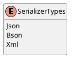

**Documentation for Eliassen.System.Text.SerializerTypes.cs**

**Overview**
The `SerializerTypes` enum specifies different types of serialization formats used in the Eliassen.System.Text namespace.

**Description**
The `SerializerTypes` enum defines three types of serialization formats: JSON, BSON (Binary JSON), and XML. These formats can be used to serialize and deserialize data between different systems or formats.

**Enum Members**

| Member | Description |
| --- | --- |
| Json | Represents the JSON serialization format. |
| Bson | Represents the BSON (Binary JSON) serialization format. |
| Xml | Represents the XML serialization format. |

**Class Diagram (PlantUML)**

This diagram shows the `SerializerTypes` enum with its three members: `Json`, `Bson`, and `Xml`.

**Benefits**

* Provides a clear and concise way to specify different serialization formats.
* Allows for easy switching between different serialization formats.
* Enables better error handling and debugging by providing specific type identifiers.

**Notes**