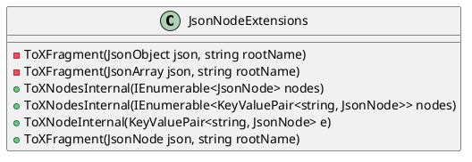

**JsonNodeExtensions Class Documentation**
========================================

### Overview

The `JsonNodeExtensions` class provides extension methods for converting System.Text.Json objects to XFragment objects. These extension methods are used to convert JSON data into XML data.

### Class Diagram


### Component Model
```plantuml
@startuml
component JsonNodeExtensions {
  component ToXFragment {
    <<interface>> ToXFragment(JsonObject json, string rootName)
  }
  component ToXFragment {
    <<interface>> ToXFragment(JsonArray json, string rootName)
  }
  component ToXNodesInternal {
    <<implementation>> ToXNodesInternal(IEnumerable<JsonNode> nodes)
  }
  component ToXNodesInternal {
    <<implementation>> ToXNodesInternal(IEnumerable<KeyValuePair<string, JsonNode>> nodes)
  }
  component ToXNodeInternal {
    <<implementation>> ToXNodeInternal(KeyValuePair<string, JsonNode> e)
  }
  component ToXFragment {
    <<implementation>> ToXFragment(JsonNode json, string rootName)
  }
}

@enduml
```

### Sequence Diagram
```plantuml
@startuml
sequenceDiagram
actor User
User->>JsonNodeExtensions: ToXFragment(JsonObject json, string rootName)
JsonNodeExtensions->>json: Convert to XFragment
JsonNodeExtensions->>User: XFragment
User->>JsonNodeExtensions: ToXFragment(JsonArray json, string rootName)
JsonNodeExtensions->>json: Convert to XFragment
JsonNodeExtensions->>User: XFragment
User->>JsonNodeExtensions: ToXFragment(JsonNode json, string rootName)
JsonNodeExtensions->>json: Convert to XFragment
JsonNodeExtensions->>User: XFragment
note "JsonNodeExtensions performs conversion" as n1

@enduml
```

### Method Documentation
-------------------------

#### ToXFragment(JsonObject json, string rootName)

Converts a JsonObject to an XFragment.

* Parameters:
	+ `json`: The JsonObject to convert.
	+ `rootName`: The root name for the resulting XML element.
* Returns: An XFragment representing the JsonObject.

#### ToXFragment(JsonArray json, string rootName)

Converts a JsonArray to an XFragment.

* Parameters:
	+ `json`: The JsonArray to convert.
	+ `rootName`: The root name for the resulting XML element.
* Returns: An XFragment representing the JsonArray.

#### ToXNodesInternal(IEnumerable<JsonNode> nodes)

Converts a collection of JsonNodes to a collection of XNodes.

* Parameters:
	+ `nodes`: The collection of JsonNodes to convert.
* Returns: The collection of XNodes.

#### ToXNodesInternal(IEnumerable<KeyValuePair<string, JsonNode>> nodes)

Converts a collection of key-value pairs to a collection of XNodes.

* Parameters:
	+ `nodes`: The collection of key-value pairs to convert.
* Returns: The collection of XNodes.

#### ToXNodeInternal(KeyValuePair<string, JsonNode> e)

Converts a key-value pair to an XNode.

* Parameters:
	+ `e`: The key-value pair to convert.
* Returns: The XNode.

#### ToXFragment(JsonNode json, string rootName)

Converts a JsonNode to an XFragment.

* Parameters:
	+ `json`: The JsonNode to convert.
	+ `rootName`: The root name for the resulting XML element.
* Returns: An XFragment representing the JsonNode.

### Notes
-----

* This documentation is for the `JsonNodeExtensions` class, which provides extension methods for converting System.Text.Json objects to XFragment objects.
* The class has several methods, including `ToXFragment` and `ToXNodesInternal`, which perform the conversion from JSON to XML.
* The sequence diagram shows the flow of the conversion process.
* The component model shows the components of the `JsonNodeExtensions` class.