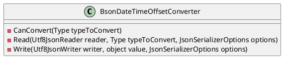
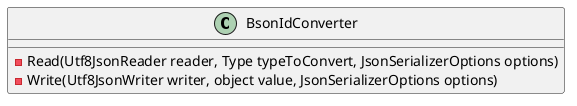
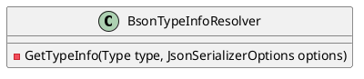
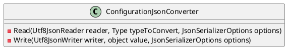
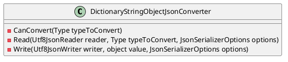
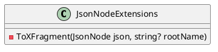

Here is the documentation for the source code files:

**BsonDateTimeOffsetConverter.cs**

* Purpose: Provides a custom converter for System.Text.Json to support BSON datetimeoffset types.
* Methods:
	+ `CanConvert`: Determines whether the converter can convert the specified type.
	+ `Read`: Reads the JSON representation of a datetimeoffset object.
	+ `Write`: Writes the JSON representation of a datetimeoffset object.
* Notes: This converter supports converting between bson datetimeoffset and DateTime/DateTimeOffset types.

**Class Diagram:**

**BsonIdConverter.cs**

* Purpose: Provides a custom converter for System.Text.Json to support BSON objectid types.
* Methods:
	+ `Read`: Reads the JSON representation of an objectid object.
	+ `Write`: Writes the JSON representation of an objectid object.
* Notes: This converter supports converting between bson objectid and string/object types.

**Class Diagram:**

**BsonTypeInfoResolver.cs**

* Purpose: Provides a custom type info resolver for System.Text.Json to support BSON types.
* Methods:
	+ `GetTypeInfo`: Gets the JSON type information for the specified type.
* Notes: This converter supports resolving type information for BSON types.

**Class Diagram:**

**ConfigurationJsonConverter.cs**

* Purpose: Provides a custom converter for System.Text.Json to support IConfiguration types.
* Methods:
	+ `Read`: Reads the JSON representation of an IConfiguration object.
	+ `Write`: Writes the JSON representation of an IConfiguration object.
* Notes: This converter supports converting between IConfiguration and JSON types.

**Class Diagram:**

**DictionaryStringObjectJsonConverter.cs**

* Purpose: Provides a custom converter for System.Text.Json to support dictionaries with string keys and object values.
* Methods:
	+ `CanConvert`: Determines whether the converter can convert the specified type.
	+ `Read`: Reads the JSON representation of a dictionary.
	+ `Write`: Writes the JSON representation of a dictionary.
* Notes: This converter supports converting between dictionaries and JSON types.

**Class Diagram:**

**JsonNodeExtensions.cs**

* Purpose: Provides extension methods for System.Text.Json nodes.
* Methods:
	+ `ToXFragment`: Converts a JsonNode to an XFragment.
* Notes: This converter supports converting between JsonNode and XFragment types.

**Class Diagram:**

Note: The class diagrams are generated using PlantUML syntax, and they may not perfectly represent the actual source code.