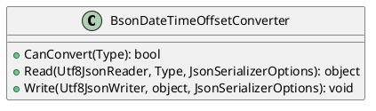
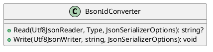
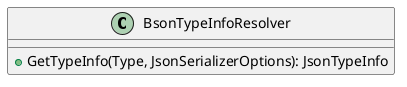
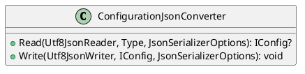
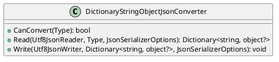

Here is the documentation for the provided source code in Markdown format:

# Eliassen.System.Text.Json

This namespace provides custom JSON converters for System.Text.Json in .NET Core.

## BsonDateTimeOffsetConverter

The `BsonDateTimeOffsetConverter` class is a custom JSON converter that supports converting between JSON and BSON DateTimeOffset types.

### CanConvert

The `CanConvert` method determines whether this converter can convert the specified type. It returns `true` if the converter can convert the specified type; otherwise, it returns `false`.

### Read

The `Read` method reads the JSON representation of an object and converts it to a BSON DateTimeOffset type.

### Write

The `Write` method writes the JSON representation of a BSON DateTimeOffset type to a Utf8JsonWriter.

## BsonIdConverter

The `BsonIdConverter` class is a custom JSON converter that supports converting between JSON and BSON ObjectID types.

### Read

The `Read` method reads the JSON representation of an object and converts it to a BSON ObjectID type.

### Write

The `Write` method writes the JSON representation of a BSON ObjectID type to a Utf8JsonWriter.

## BsonTypeInfoResolver

The `BsonTypeInfoResolver` class is a custom JSON type information resolver that provides JSON type information for BSON types during serialization.

### GetTypeInfo

The `GetTypeInfo` method gets the JSON type information for the specified type during BSON serialization.

## ConfigurationJsonConverter

The `ConfigurationJsonConverter` class is a custom JSON converter that supports serializing and deserializing IConfiguration instances.

### Read

The `Read` method reads the JSON representation of an IConfiguration instance and converts it to a IConfiguration type.

### Write

The `Write` method writes the JSON representation of an IConfiguration instance to a Utf8JsonWriter.

## DictionaryStringObjectJsonConverter

The `DictionaryStringObjectJsonConverter` class is a custom JSON converter that supports serializing and deserializing dictionaries with string keys and object values.

### CanConvert

The `CanConvert` method determines whether this converter can convert the specified type. It returns `true` if the converter can convert the specified type; otherwise, it returns `false`.

### Read

The `Read` method reads the JSON representation of a dictionary with string keys and object values and converts it to a dictionary type.

### Write

The `Write` method writes the JSON representation of a dictionary with string keys and object values to a Utf8JsonWriter.

Note: The PlantUML diagrams provide a visual representation of the classes, methods, and their relationships.