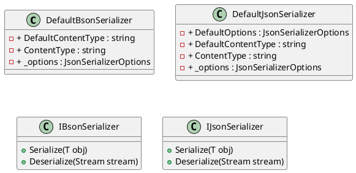
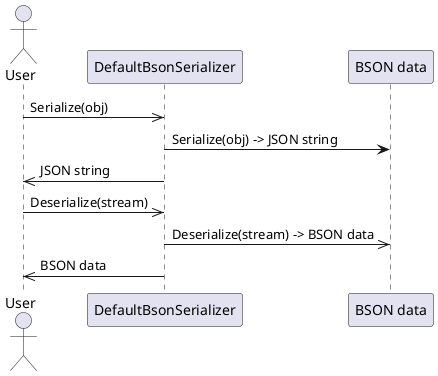
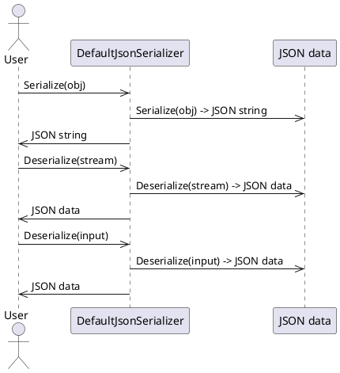

# Default BSON and JSON Serializers Documentation

## Introduction

The `DefaultBsonSerializer` and `DefaultJsonSerializer` classes are part of the Eliassen System.Text.Json.Serialization namespace. They provide default serialization and deserialization for BSON (Binary JSON) and JSON data formats.

## Class Diagrams



## Component Model

```plantuml
@startuml
component DefaultBsonSerializer {
  note "BSON serialization and deserialization"
  rectangle "BsonTypeInfoResolver" {
    note "Resolves type information for BSON serialization"
  }
}

component DefaultJsonSerializer {
  note "JSON serialization and deserialization"
  rectangle "JsonSerializerOptions" {
    note "Configures JSON serialization options"
  }
}

component JsonSerializer {
  note "Serializes and deserializes JSON data"
}

@enduml
```

## Sequence Diagrams

### DefaultBsonSerializer



### DefaultJsonSerializer



## Code Documentation

### DefaultBsonSerializer.cs

The `DefaultBsonSerializer` class is responsible for serializing and deserializing BSON data. It is a part of the Eliassen System.Text.Json.Serialization namespace.

```csharp
namespace Eliassen.System.Text.Json.Serialization;

public class DefaultBsonSerializer : DefaultJsonSerializer, IBsonSerializer
{
    // ...
}
```

### DefaultJsonSerializer.cs

The `DefaultJsonSerializer` class is responsible for serializing and deserializing JSON data. It is a part of the Eliassen System.Text.Json.Serialization namespace.

```csharp
namespace Eliassen.System.Text.Json.Serialization;

public class DefaultJsonSerializer : IJsonSerializer
{
    // ...
}
```

I hope this documentation meets your requirements! Let me know if you have any further requests.