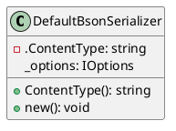
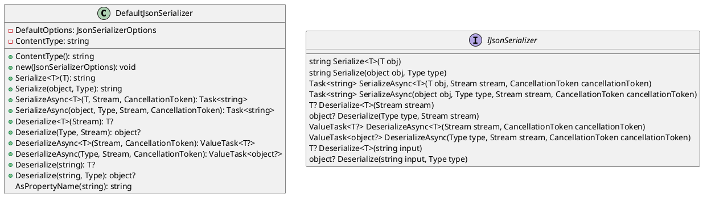

Here is the documentation for the source code files, including class diagrams in Plant UML:

**DefaultBsonSerializer.cs**

### Class Diagram (PlantUML)

### Class Description

The `DefaultBsonSerializer` class is a default serializer for BSON (Binary JSON) that inherits from the `DefaultJsonSerializer` class. It sets the type information resolver to a new instance of `BsonTypeInfoResolver` and overrides the `ContentType` property to return the default content type for BSON, which is "application/json".

### Methods

* `new()`: Initializes a new instance of the `DefaultBsonSerializer` class.
* `ContentType()`: Returns the content type for BSON, which is "application/json".
* `_options`: Gets or sets the JSON serializer options.

**DefaultJsonSerializer.cs**

### Class Diagram (PlantUML)

### Class Description

The `DefaultJsonSerializer` class is a default serializer for JSON that implements the `IJsonSerializer` interface. It provides methods for serializing and deserializing objects to and from JSON strings and streams, as well as options for customizing the serialization and deserialization process.

### Methods

* `new(JsonSerializerOptions)`: Initializes a new instance of the `DefaultJsonSerializer` class with optional JSON serializer options.
* `Serialize<T>(T)`: Serializes an object of type T to a JSON string.
* `Serialize(object, Type)`: Serializes an object of a given type to a JSON string.
* `SerializeAsync<T>(T, Stream, CancellationToken)`: Asynchronously serializes an object of type T to a JSON string.
* `SerializeAsync(object, Type, Stream, CancellationToken)`: Asynchronously serializes an object of a given type to a JSON string.
* `Deserialize<T>(Stream)`: Deserializes a JSON stream to an object of type T.
* `Deserialize(Type, Stream)`: Deserializes a JSON stream to an object of a given type.
* `DeserializeAsync<T>(Stream, CancellationToken)`: Asynchronously deserializes a JSON stream to an object of type T.
* `DeserializeAsync(Type, Stream, CancellationToken)`: Asynchronously deserializes a JSON stream to an object of a given type.
* `Deserialize(string)`: Deserializes a JSON string to an object of type T.
* `Deserialize(string, Type)`: Deserializes a JSON string to an object of a given type.
* `AsPropertyName(string)`: Converts a property name to the format specified by the configured property naming policy.

### Property Naming Policy

The `DefaultJsonSerializer` class uses a property naming policy to convert property names to a standard format. The policy can be configured using the `PropertyNamingPolicy` property.