**Readme File**

This repository contains a set of .NET classes that provide serialization and deserialization functionality for JSON and BSON data formats. The classes are designed to be flexible and configurable, allowing developers to customize the serialization process to meet their specific needs.

**Overview**

The repository includes two main classes: `DefaultJsonSerializer` and `DefaultBsonSerializer`. The `DefaultJsonSerializer` class provides basic JSON serialization and deserialization functionality, while the `DefaultBsonSerializer` class provides similar functionality for BSON data format. Both classes inherited from `DefaultJsonSerializer` and provide a way to serialize and deserialize .NET objects to and from JSON or BSON strings.

**Technical Summary**

The classes utilize various design patterns and architectural patterns to facilitate flexibility and customization. Specifically:

* The `DefaultJsonSerializer` and `DefaultBsonSerializer` classes implement the Singleton pattern, allowing for a single instance of the serializer to be used throughout the application.
* The classes utilize the Strategy pattern to switch between different serialization formats (JSON and BSON).
* The `DefaultJsonSerializer` and `DefaultBsonSerializer` classes use the Template Method pattern to provide a way to customize the serialization and deserialization process.

**Component Diagram**

Here is a component diagram of the system using PlantUML:

```plantuml
@startuml
class DefaultJsonSerializer {
  -options: JsonSerializerOptions
  +Serialize(object obj)
  +SerializeAsync(object obj, Stream stream, CancellationToken cancellationToken)
  +Deserialize(Stream stream)
  +DeserializeAsync(Stream stream, CancellationToken cancellationToken)
}

class DefaultBsonSerializer {
  -options: JsonSerializerOptions
  +Serialize(object obj)
  +SerializeAsync(object obj, Stream stream, CancellationToken cancellationToken)
  +Deserialize(Stream stream)
  +DeserializeAsync(Stream stream, CancellationToken cancellationToken)
}

class JsonSerializerOptions {
  -writeIndented: boolean
  -propertyNameCaseInsensitive: boolean
  -...: ...
}

class Stream {
  +Write(byte[] buffer, int offset, int count)
  +WriteAsync(byte[] buffer, int offset, int count, CancellationToken cancellationToken)
}

class CancellationToken {
  +Cancel()
  +ThrowIfCancellationRequested()
}

DefaultJsonSerializer -> JsonSerializerOptions
DefaultBsonSerializer -> JsonSerializerOptions
JsonSerializerOptions -> Stream
Stream -> CancellationToken
@enduml
```

Note: The diagram shows the relationships between the classes, but omits some implementation details for brevity.