**README File**

This repository contains a set of extension methods for the `System.Text.Json` namespace, specifically for converting `JsonNode` objects to `XDocument` objects.

The `JsonNodeExtensions` class provides methods for converting `JsonObject` and `JsonArray` instances to `XElement` objects, as well as a method for converting individual `JsonNode` objects to `XFragment` objects. These conversions are done using a combination of LINQ queries and the `XElement` and `XAttribute` classes from the `System.Xml.Linq` namespace.

The conversion process involves recursively traversing the JSON object or array, creating `XElement` or `XAttribute` objects as needed, and adding them to the resulting `XDocument` object.

**Technical Summary**

The `JsonNodeExtensions` class uses a combination of design patterns and architectural patterns to achieve its functionality. Specifically:

* **Visitor Pattern**: The `ToXNodesInternal` and `ToXNodeInternal` methods use the Visitor pattern to traverse the JSON object or array and create `XElement` or `XAttribute` objects as needed.
* **Strategy Pattern**: The `ToXFragment` method uses a strategy pattern to determine which conversion algorithm to use based on the type of `JsonNode` object being converted.
* **Chain of Responsibility Pattern**: The `ToXFragment` method uses a chain of responsibility pattern to recursively traverse the JSON object or array and create `XElement` or `XAttribute` objects as needed.

**Component Diagram**

```plantuml
@startuml
class JsonNodeExtensions {
  - ToXFragment: XFragment? <- JsonObject?
  - ToXFragment: XFragment? <- JsonArray?
  - ToXFragment: XFragment? <- JsonNode?
}

class JsonObject {
  - ToXFragment: XFragment? <<-XFragment?
}

class JsonArray {
  - ToXFragment: XFragment? <<-XFragment?
}

class JsonNode {
  - ToXFragment: XFragment? <<-XFragment?
}

class XDocument {
  - XFragment: XFragment?
}

class XElement {
  - XAttribute: XAttribute?
}

class XAttribute {
  - Value: string
}

JsonNodeExtensions -> JsonObject: ToXFragment
JsonNodeExtensions -> JsonArray: ToXFragment
JsonNodeExtensions -> JsonNode: ToXFragment
JsonObject -> XFragment: ToXFragment
JsonArray -> XFragment: ToXFragment
JsonNode -> XFragment: ToXFragment
XDocument -> XFragment: XFragment
XElement -> XAttribute: XAttribute
XAttribute -> string: Value

@enduml
```

This component diagram shows the classes and interfaces involved in the conversion process, as well as the relationships between them. The `JsonNodeExtensions` class is the main entry point for the conversions, and it interacts with the `JsonObject`, `JsonArray`, and `JsonNode` classes to perform the conversions. The resulting `XDocument` object is created using the `XFragment` objects returned by the conversion methods.