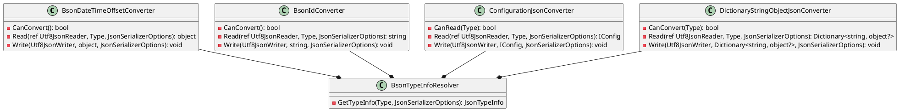

**README**

This repository contains a set of custom converters for System.Text.Json to support various data types and formats. The converters are designed to work with the .NET Core 3.1 JSON serialization library and provide additional functionality for serializing and deserializing specific types.

**Converter Summaries**

1. **BsonDateTimeOffsetConverter**: This converter supports serializing and deserializing `DateTimeOffset` and `DateTime` types to and from JSON.
2. **BsonIdConverter**: This converter supports serializing and deserializing `string` and `ObjectId` types to and from JSON.
3. **BsonTypeInfoResolver**: This resolver provides custom JSON type information for BSON serialization, allowing for specific types to be handled differently.
4. **ConfigurationJsonConverter**: This converter supports serializing and deserializing `IConfiguration` instances to and from JSON.
5. **DictionaryStringObjectJsonConverter**: This converter supports serializing and deserializing `Dictionary<string, object>` and `Dictionary<string, object?>` instances to and from JSON.

**Technical Summary**

The converters use various design patterns and architectural patterns to implement their functionality. Specifically:

* **BsonDateTimeOffsetConverter** and **BsonIdConverter** use the Visitor design pattern to traverse the JSON token stream and convert specific types.
* **BsonTypeInfoResolver** uses the Factory pattern to create custom JSON type information for specific types.
* **ConfigurationJsonConverter** uses the Adapter pattern to convert between `IConfiguration` instances and JSON serialized data.
* **DictionaryStringObjectJsonConverter** uses the Composite pattern to recursively convert nested objects and arrays.

**Component Diagram**

This diagram shows the relationships between the converter classes and the `BsonTypeInfoResolver` class, which provides custom JSON type information for BSON serialization. The converters use the `BsonTypeInfoResolver` to get custom JSON type information for specific types.