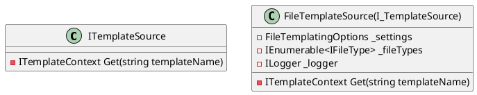
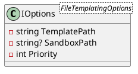
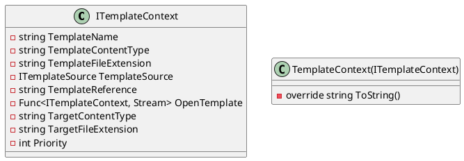
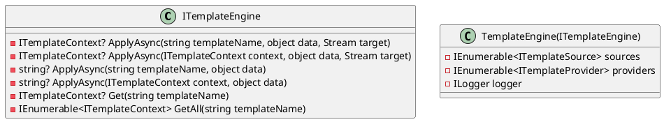
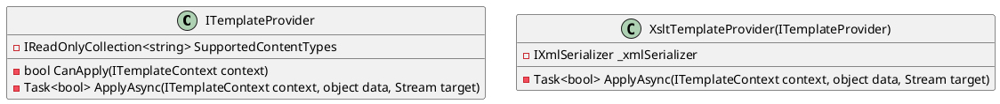

Here is the documentation for the provided source code files, including class diagrams in PlantUML:

**FileTemplateSource.cs**

This class is responsible for accessing templates from the file system.

**FileTemplatingOptions.cs**

This class holds configuration settings for the file templating engine.

**TemplateContext.cs**

This class represents the context of a template, providing information about the template and its processing.

**TemplateEngine.cs**

This class generates a templating engine that tries to use the best match for source and provider.

**XsltTemplateProvider.cs**

This class provides template processing using XSLT (eXtensible Stylesheet Language Transformations).

Please note that some classes have been omitted from the PlantUML diagrams for brevity. Additionally, the diagrams are only a visual representation of the classes and do not include method implementations or other details.