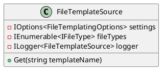
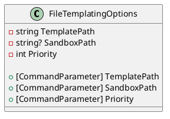
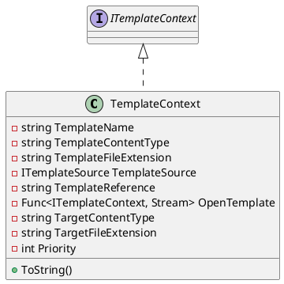
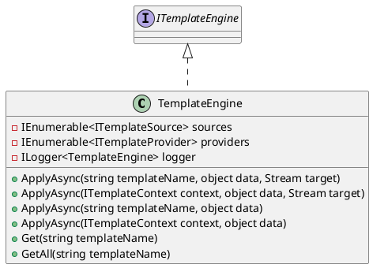
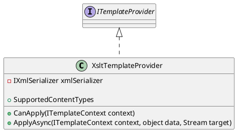

Here is the documentation for the provided code in Markdown format:

**System.Text.Templating**
======================

The System.Text.Templating namespace provides a set of classes and interfaces for working with templates and template engines.

### FileTemplateSource
-------------------

The `FileTemplateSource` class is responsible for looking up templates from a file system.

**Class Diagram**

**Description**

The `FileTemplateSource` class takes an instance of `IOptions<FileTemplatingOptions>`, an instance of `IEnumerable<IFileType>`, and an instance of `ILogger<FileTemplateSource>` as constructor parameters. The `Get` method is used to look up templates from the file system and returns a collection of `ITemplateContext` objects.

### FileTemplatingOptions
----------------------

The `FileTemplatingOptions` class is used to configure the file templating engine.

**Class Diagram**

**Description**

The `FileTemplatingOptions` class provides three properties:

* `TemplatePath`: the path to the template files
* `SandboxPath`: the path to the sandbox directory
* `Priority`: the priority of the template

These properties can be set using command-line parameters.

### TemplateContext
-----------------

The `TemplateContext` class represents the context of a template.

**Class Diagram**

**Description**

The `TemplateContext` class provides several properties:

* `TemplateName`: the name of the template
* `TemplateContentType`: the content type of the template
* `TemplateFileExtension`: the file extension of the template
* `TemplateSource`: the source of the template
* `TemplateReference`: the reference identifier of the template
* `OpenTemplate`: a function to open the template as a stream
* `TargetContentType`: the content type of the target
* `TargetFileExtension`: the file extension of the target
* `Priority`: the priority of the template

The `ToString` method is used to return a string representation of the template context.

### TemplateEngine
-----------------

The `TemplateEngine` class is responsible for applying templates to data.

**Class Diagram**

**Description**

The `TemplateEngine` class takes an instance of `IEnumerable<ITemplateSource>`, an instance of `IEnumerable<ITemplateProvider>`, and an instance of `ILogger<TemplateEngine>` as constructor parameters. The `ApplyAsync` method is used to apply a template to data and returns a task representing the asynchronous operation. The `Get` and `GetAll` methods are used to retrieve template contexts.

### XsltTemplateProvider
-----------------------

The `XsltTemplateProvider` class is responsible for processing XSLT templates.

**Class Diagram**

**Description**

The `XsltTemplateProvider` class takes an instance of `IXmlSerializer` as constructor parameter. The `SupportedContentTypes` property returns a collection of supported content types. The `CanApply` method is used to determine whether the template provider can apply template processing to the given context. The `ApplyAsync` method is used to apply the XSLT template associated with the specified context to the provided data and writes the result to the target stream