**README File**

This repository contains a file templating engine with support for multiple file templates, template providers, and template engines. The engine is designed to be extensible and modular, allowing developers to easily add new template sources, providers, and engines.

**Technical Summary**

The file templating engine uses the following design patterns and architectural patterns:

* **Builder Pattern**: The `FileTemplateSource` class is implemented using the Builder pattern to allow for easy construction of template sources.
* **Factory Pattern**: The `ITemplateProvider` interface is implemented using the Factory pattern to allow for easy creation of template providers.
* **Template Method Pattern**: The `ITemplateEngine` interface is implemented using the Template Method pattern to provide a framework for template engines.

The architecture of the engine is based on the following components:

* **Template Sources**: These provide access to template files and their metadata.
* **Template Providers**: These encapsulate the logic for applying templates to data.
* **Template Engines**: These manage the template processing workflow and provide a interface for applying templates.

**Component Diagram**

```plantuml
@startuml
class FileTemplateSource {
  - IOptions<FileTemplatingOptions> settings
  - IEnumerable<IFileType> fileTypes
  - ILogger logger
}

class ITemplateSource {
  + IEnumerable<ITemplateContext> Get(string templateName)
}

class FileTemplatingOptions {
  - TemplatePath
  - SandboxPath
  - Priority
}

class ITemplateContext {
  + string TemplateName
  + string TemplateContentType
  + string TemplateFileExtension
  + ITemplateSource TemplateSource
  + string TemplateReference
  + Func<ITemplateContext, Stream> OpenTemplate
  + string TargetContentType
  + string TargetFileExtension
  + int Priority
}

class ITemplateProvider {
  + bool CanApply(ITemplateContext context)
  + Task<bool> ApplyAsync(ITemplateContext context, object data, Stream target)
}

class XsltTemplateProvider implements ITemplateProvider {
  - IXmlSerializer xmlSerializer
}

class ITemplateEngine {
  + Task<ITemplateContext?> ApplyAsync(string templateName, object data, Stream target)
  + Task<bool> ApplyAsync(ITemplateContext context, object data, Stream target)
  + ITemplateContext? Get(string templateName)
  + IEnumerable<ITemplateContext> GetAll(string templateName)
}

class TemplateEngine implements ITemplateEngine {
  - IEnumerable<ITemplateSource> sources
  - IEnumerable<ITemplateProvider> providers
  - ILogger logger
}

FileTemplateSource -> ITemplateSource
FileTemplatingOptions -> FileTemplateSource
ITemplateSource -> ITemplateContext
ITemplateContext -> ITemplateSource
ITemplateProvider -> ITemplateEngine
XsltTemplateProvider -> ITemplateProvider
ITemplateEngine -> TemplateEngine

@enduml
```

This component diagram shows the relationships between the classes and interfaces in the file templating engine. The `FileTemplateSource` class provides access to template files and their metadata, while the `ITemplateSource` interface defines the interface for retrieving template contexts. The `ITemplateContext` interface defines the structure of a template context, including the template name, content type, and file extension. The `ITemplateProvider` interface defines the interface for applying templates, and the `XsltTemplateProvider` class implements this interface using the XSLT transformation language. The `ITemplateEngine` interface defines the interface for managing the template processing workflow, and the `TemplateEngine` class implements this interface using a collection of template sources and providers.