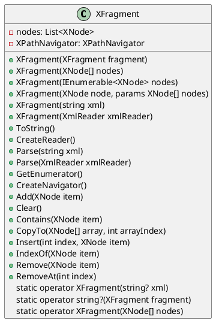

# Documentation for XFragment

## Overview

The `XFragment` class represents a fragment of XML nodes with additional functionality for manipulation and conversion. It allows you to work with XML fragments, which are useful when you need to parse or manipulate a subset of an XML document.

## Constructors

### XFragment(XFragment fragment)

Initializes a new instance of the `XFragment` class with the specified fragment.

### XFragment(XNode[] nodes)

Initializes a new instance of the `XFragment` class with the specified nodes.

### XFragment(IEnumerable<XNode> nodes)

Initializes a new instance of the `XFragment` class with the specified nodes.

### XFragment(XNode node, params XNode[] nodes)

Initializes a new instance of the `XFragment` class with the specified nodes.

### XFragment(string? xml)

Initializes a new instance of the `XFragment` class with the specified XML string.

### XFragment(XmlReader xmlReader)

Initializes a new instance of the `XFragment` class with the specified XML reader.

## Methods

### ToString()

Returns the XML string representation of the fragment.

### CreateReader()

Creates an XML reader for the fragment.

### Parse(string xml)

Parses the specified XML string into an `XFragment` instance.

### Parse(XmlReader xmlReader)

Parses the XML content from the specified reader into an `XFragment` instance.

### GetEnumerator()

Returns an enumerator that iterates through the collection of XML nodes.

### CreateNavigator()

Creates an XPath navigator for navigating the fragment.

### Add(XNode item)

Adds an XML node to the end of the collection.

### Clear()

Removes all XML nodes from the collection.

### Contains(XNode item)

Determines whether the collection contains a specific XML node.

### CopyTo(XNode[] array, int arrayIndex)

Copies the elements of the collection to an array, starting at a particular index.

### Insert(int index, XNode item)

Inserts an XML node into the collection at the specified index.

### IndexOf(XNode item)

Determines the index of a specific XML node in the collection.

### Remove(XNode item)

Removes the first occurrence of a specific XML node from the collection.

### RemoveAt(int index)

Removes the XML node at the specified index from the collection.

### this[int index]

Gets or sets the XML node at the specified index.

### this[XNode item]

Gets or sets the XML node at the specified index.

### static implicit operator XFragment(string? xml)

Implicitly converts a string to an `XFragment` instance.

### static implicit operator string?(XFragment fragment)

Implicitly converts an `XFragment` instance to a string.

### static implicit operator XFragment(XNode[] nodes)

Implicitly converts an array of XML nodes to an `XFragment` instance.

## Properties

### Count

Gets the number of elements contained in the collection of XML nodes.

### IsReadOnly

Gets a value indicating whether the collection of XML nodes is read-only.

### Nodes

Gets the collection of XML nodes.

### XPathNavigator

Gets an XPath navigator for navigating the fragment.

## Class Diagram



## Component Model

```plantuml
@startuml
component XFragment {
  -nodes: List<XNode>
  -XPathNavigator: XPathNavigator
  interface XNode {
    +ToString()
    +CreateReader()
  }
  interface XPathNavigator {
    +MoveToContent()
    +ReadState
    +ReadObject()
  }
}

@enduml
```

## Sequence Diagram

```plantuml
@startuml
seqlauncher XFragment creation

actor User
participant XFragment as XF
participant XmlReader as XR

note left of XR
XmlReader reads XML content
from a source (e.g. file, network)
end note

XF -> XR: CreateXmlReader()
XR -> XF: XML content
XF -> User: XML fragment
User -> XF: Parse XML string
XF -> User