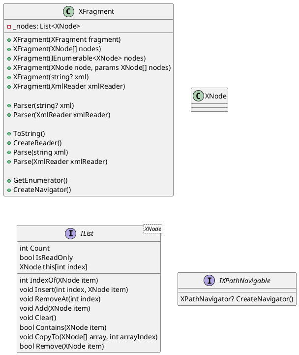

**Documentation for XFragment class**

**Class Diagram using PlantUML**

**Description of XFragment class:**

XFragment is a class that represents a fragment of XML nodes with additional functionality for manipulation and conversion. It supports various methods for initialization, parsing, and conversion to and from string, array of XML nodes, and XPath navigator.

**Initialization methods:**

1. `XFragment(XFragment fragment)`: Initializes a new instance of the class with the specified fragment.
2. `XFragment(XNode[] nodes)`: Initializes a new instance of the class with the specified array of XML nodes.
3. `XFragment(IEnumerable<XNode> nodes)`: Initializes a new instance of the class with the specified enumerable of XML nodes.
4. `XFragment(XNode node, params XNode[] nodes)`: Initializes a new instance of the class with the specified XML node and optional array of XML nodes.
5. `XFragment(string? xml)`: Initializes a new instance of the class with the specified XML string.
6. `XFragment(XmlReader xmlReader)`: Initializes a new instance of the class with the specified XML reader.

**Parsing methods:**

1. `Parser(string? xml)`: Returns an enumerable of XML nodes parsed from the specified XML string.
2. `Parser(XmlReader xmlReader)`: Returns an enumerable of XML nodes parsed from the specified XML reader.

**Conversion methods:**

1. `ToString()`: Returns the XML string representation of the fragment.
2. `CreateReader()`: Creates an XML reader for the fragment.
3. `Parse(string xml)`: Parses the specified XML string into an XFragment instance.
4. `Parse(XmlReader xmlReader)`: Parses the XML content from the specified reader into an XFragment instance.

**Other methods:**

1. `GetEnumerator()`: Returns an enumerator that iterates through the collection of XML nodes.
2. `CreateNavigator()`: Creates an XPath navigator for navigating the fragment.

**Interfaces implemented:**

1. `IList<XNode>`: Implements the list interface for manipulating the collection of XML nodes.
2. `IXPathNavigable`: Implements the XPath navigable interface for creating an XPath navigator.

The class provides various methods for working with XML nodes and fragments, including initialization, parsing, and conversion. It also provides methods for iterating through the collection of XML nodes and creating an XPath navigator.