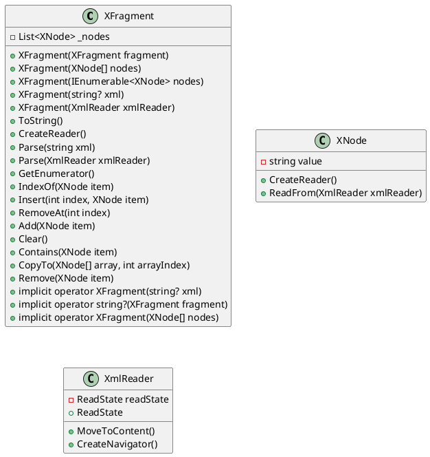

**README**

**Summary**
The `XFragment` class represents a collection of XML nodes with additional functionality for manipulation and conversion. It provides a flexible way to work with XML fragments, allowing you to create, parse, and manipulate XML nodes in a variety of ways.

**Technical Summary**
The `XFragment` class is built using a combination of design patterns and architectural patterns. Specifically:

* **Builder Pattern**: The class uses a builder pattern to construct an instance of `XFragment` from various sources, including XML strings, XML readers, and arrays of XML nodes.
* **Composite Pattern**: The class uses a composite pattern to combine multiple XML nodes into a single `XFragment` instance.
* **Adapter Pattern**: The class uses an adapter pattern to convert between different types of XML nodes and `XFragment` instances.

**Component Diagram**

This diagram shows the relationships between the main classes in the `XFragment` system, including `XFragment`, `XNode`, and `XmlReader`. The diagram illustrates the composition of `XFragment` instances from `XNode` instances and the conversion between `XFragment` instances and XML strings.