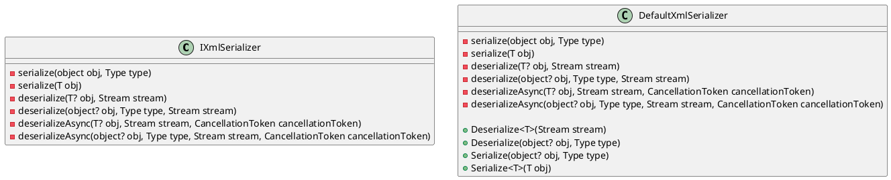

# Eliassen.System.Text.Xml.Serialization

## DefaultXmlSerializer

### Overview

`DefaultXmlSerializer` is a basic XML serialization implementation that provides functionality for converting objects into and out of XML format.

### Class Diagram

