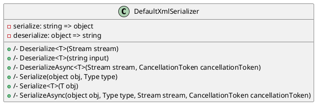

Here is the documentation for the `DefaultXmlSerializer` class:

**Class Diagram**



**Introduction**

The `DefaultXmlSerializer` class is a default implementation of the `IXmlSerializer` interface, providing basic XML serialization and deserialization functionality.

**Properties**

* `DefaultContentType`: A constant string representing the default content type for XML serialization, set to `"text/xml"`.
* `ContentType`: A virtual property returning the content type used for XML serialization, which defaults to `DefaultContentType`.

**Methods**

**Serialization**

* `Serialize<T>(T obj)`: Converts an object of type `T` to a XML string.
* `Serialize(object obj, Type type)`: Converts an object of type `type` to a XML string.
* `SerializeAsync<T>(T obj, Stream stream, CancellationToken cancellationToken)`: Asynchronously converts an object of type `T` to a XML stream.
* `SerializeAsync(object obj, Type type, Stream stream, CancellationToken cancellationToken)`: Asynchronously converts an object of type `type` to a XML stream.

**Deserialization**

* `Deserialize<T>(Stream stream)`: Converts a XML stream to an object of type `T`.
* `Deserialize<T>(string input)`: Converts a XML string to an object of type `T`.
* `DeserializeAsync<T>(Stream stream, CancellationToken cancellationToken)`: Asynchronously converts a XML stream to an object of type `T`.

**Notes**

* The `Deserialize` and `Serialize` methods use the `XmlSerializer` class from the .NET Framework.
* The `SerializeAsync` and `DeserializeAsync` methods use asynchronous programming to serialize and deserialize objects.
* The `ContentType` property returns the default content type for XML serialization.
* The `DefaultXmlSerializer` class can be used to serialize and deserialize objects of any type that supports XML serialization.

**Usage**

To use the `DefaultXmlSerializer` class, simply instantiate it and call its methods to serialize and deserialize objects. For example:
```csharp
var serializer = new DefaultXmlSerializer();
var obj = new MyObject { Prop1 = "Value1", Prop2 = "Value2" };
var xml = serializer.Serialize(obj);
var deserializedObj = serializer.Deserialize<MyObject>(xml);
```
In this example, the `DefaultXmlSerializer` class is used to serialize an instance of the `MyObject` class to a XML string, and then deserialize the XML string back to an instance of the `MyObject` class.