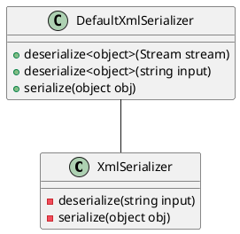

**README**

The `DefaultXmlSerializer` namespace provides a set of classes and methods for serializing and deserializing objects to and from XML. These classes are designed to be used as a default implementation for XML serialization, providing a straightforward way to convert objects to and from XML without requiring additional configuration or setup.

**Technical Summary**

The `DefaultXmlSerializer` class implements the `IXmlSerializer` interface, which provides methods for deserializing and serializing objects to and from XML. The class uses the `System.Xml` namespace and the `XmlSerializer` class from .NET's built-in XML serialization library.

The `DefaultXmlSerializer` class uses the following design patterns and architectural patterns:

* **Singleton pattern**: The `DefaultXmlSerializer` class is designed to be a singleton, providing a global instance of the serializer that can be used throughout the application.
* **Factory pattern**: The `DefaultXmlSerializer` class provides a factory method for creating instances of the `XmlSerializer` class, which is used for deserializing and serializing objects.
* **Abstract Factory pattern**: The `DefaultXmlSerializer` class provides a set of methods for serializing and deserializing objects, which are abstracted away from the underlying implementation using the `XmlSerializer` class.

**Component Diagram**

Here is a component diagram of the `DefaultXmlSerializer` class using PlantUML:
```

```
This component diagram shows the relationship between the `DefaultXmlSerializer` class and the `XmlSerializer` class, which is used for deserializing and serializing objects. The `DefaultXmlSerializer` class provides a set of methods for serializing and deserializing objects, which are abstracted away from the underlying implementation using the `XmlSerializer` class.