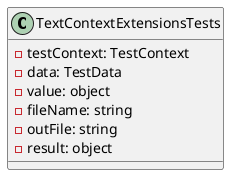

Here is the documentation for the source code files, including class diagrams in PlantUML:

**Tests.csproj**

This is a .NET Core project file for the Eliassen.TestUtilities.Tests project. It defines the project's metadata, such as the target framework, NuGet packages, and references to other projects.

**TextContextExtensionsTests.cs**

This is a test class for the TextContextExtensions class, which provides methods for testing the TextContext class. The class has several test methods that cover different scenarios, such as adding results to the text context, getting test data, and testing file content.

**Class Diagram for TextContextExtensionsTests**

**Test Methods:**

1. `AddResultTest_Object()`: Tests adding a result to the text context with an object value.
2. `AddResultTest_String()`: Tests adding a result to the text context with a string value.
3. `AddResultTest_Lines()`: Tests adding a result to the text context with an array of string values.
4. `AddResultTest_Object_WithFileNameNoExtension()`: Tests adding a result to the text context with an object value and a file name without an extension.
5. `AddResultTest_Object_WithFileNameAndExtension()`: Tests adding a result to the text context with an object value and a file name with an extension.
6. `AddResultTest_Object_WithFileNameAndChangeExtension()`: Tests adding a result to the text context with an object value and a file name with a changed extension.
7. `AddResultTest_Object_WithFileNameRemoveExtension()`: Tests adding a result to the text context with an object value and a file name with the extension removed.
8. `AddResultTest_Stream()`: Tests adding a result to the text context with a stream value.
9. `AddResultTest_Json()`: Tests adding a result to the text context with a JSON value.
10. `AddResultTest_ValueOutFile()`: Tests adding a result to the text context with an object value and an output file.
11. `AddResultFileTest_FileContent()`: Tests adding a file with content to the text context.
12. `AddResultFileTest_FileContentOutFile()`: Tests adding a file with content to the text context and getting the output file.
13. `GetTestDataAsyncTest()`: Tests getting test data as an object.
14. `GetTestDataAsyncTest_Targeted()`: Tests getting test data as an object with a target name.
15. `GetTestDataAsyncTest_String()`: Tests getting test data as a string.
16. `GetTestDataAsyncTest_Stream()`: Tests getting test data as a stream.

**TextContextExtensionsTests_GetTestDataAsyncTest.json**, **TextContextExtensionsTests_GetTestDataAsyncTest_Stream.json**, and **TextContextExtensionsTests_GetTestDataAsyncTest_String.json**

These are three JSON files that contain test data for the `GetTestDataAsyncTest` methods. Each file contains a single property with a value that is used to test the method.

Note: The class diagram and test method documentation are generated based on the provided code, but may not be exhaustive or accurate. Additional documentation and testing may be necessary to fully document the functionality of the code.