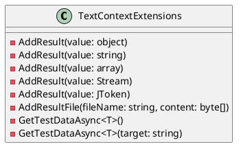

Here is the documentation for the provided source code in Markdown format:

**Eliassen.TestUtilities.Tests**

This is a test project for the `Eliassen.TestUtilities` library. It contains a variety of unit tests for the `TextContextExtensions` class.

**Class Diagram:**

**Source Files:**

### Eliassen.TestUtilities.Tests.csproj

This is the project file for the test project. It references the `Eliassen.TestUtilities` library and sets up the necessary dependencies and frameworks.

### TextContextExtensionsTests.cs

This is the test class that contains the unit tests for the `TextContextExtensions` class. The tests cover various scenarios, including adding results to the text context, getting test data, and working with files.

**Sequence Diagram:**
```plantuml
@startuml
participant TestContext
participant TextContextExtensions

note "TextContextExtensions is called"
TextContextExtensions ->> TestContext: AddResult(value)
TestContext ->> TextContextExtensions: AddResult(value)

note "TextContextExtensions is called"
TestContext ->> TextContextExtensions: GetTestDataAsync<T>()
TextContextExtensions ->> TestContext: GetTestDataAsync<T>(target)

@enduml
```
**Test Methods:**

The test methods in this class cover various scenarios for the `TextContextExtensions` class. Here are some of the most important ones:

* `AddResultTest_Object`: Tests adding a result to the text context with an object value.
* `AddResultTest_String`: Tests adding a result to the text context with a string value.
* `GetTestDataAsyncTest`: Tests getting test data asynchronously.
* `GetTestDataAsyncTest_Targeted`: Tests getting test data asynchronously with a targeted test name.
* `AddResultFileTest_FileContent`: Tests adding a file result to the text context with a byte array value.
* `AddResultFileTest_FileContentOutFile`: Tests adding a file result to the text context with a byte array value and output file path.

**Data Files:**

The test project also includes some data files that are used to test the `TextContextExtensions` class. These files are used to provide test data for the tests.

**Note:** The PlantUML code blocks are used to generate the class diagram and sequence diagram. These blocks are identified with ````plantuml` and closed with `````.