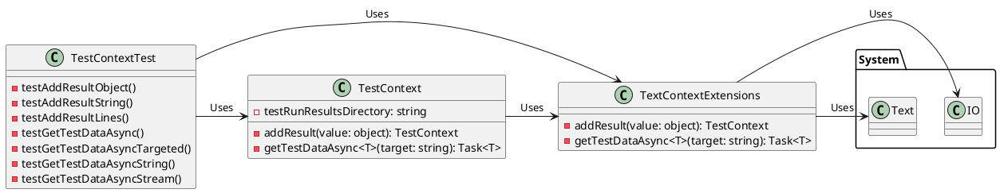

**README File**

This repository contains a collection of test files for the `TextContextExtensions` class, which provides extensions for working with text data in various formats. The files include unit tests for the `AddResult` method, which adds text data to a test context, and the `GetTestDataAsync` method, which retrieves test data from a specified location.

**Summary**

The `TextContextExtensions` class provides a set of extensions for working with text data in various formats, including strings, objects, and streams. The `AddResult` method allows you to add text data to a test context, while the `GetTestDataAsync` method retrieves test data from a specified location. The tests in this repository cover various scenarios, including adding test data with different file names, working with streams and JSON data, and retrieving test data asynchronously.

**Technical Summary**

The tests in this repository use the `Microsoft.VisualStudio.TestTools.UnitTesting` namespace to write unit tests, and the `System.Linq.Async` namespace to write asynchronous tests. The `TextContextExtensions` class is implemented using a combination of C# and .NET Core, using the `System.IO` and `System.Text` namespaces to work with files and strings.

The design of the `TextContextExtensions` class follows the principles of separation of concerns and single responsibility, with each method having a clear and well-defined purpose. The class also uses dependency injection to decouple the implementation of the extensions from the test context.

**Component Diagram**

This component diagram shows the relationships between the `TestContext`, `TextContextExtensions`, and `TestContextTest` classes. The `TestContext` class provides a test run results directory and methods for adding test data and retrieving test data asynchronously. The `TextContextExtensions` class provides extensions for adding test data and retrieving test data asynchronously. The `TestContextTest` class is a test class that uses the `TestContext` and `TextContextExtensions` classes to write unit tests.