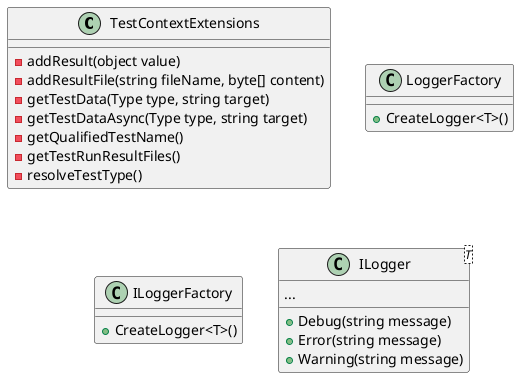

# Eliassen Test Utilities Documentation

## Overview

Eliassen Test Utilities is a library of extension methods and utility classes designed to improve unit testing capabilities within .NET projects. This documentation provides an overview of the library's features, usage, and technical details.

### Features

* **TestContext Extensions**: Provides a set of extension methods for the `TestContext` class, allowing you to easily add test results, such as files or JSON objects, to the test results.
* **Test Data Deserialization**: Offers a method to deserialize test data from embedded resources.
* **Logger instances creation**: Provides a mechanism for creating logger instances for testing purposes.

### Components

#### TestContextExtensions

The `TestContextExtensions` class contains methods for adding test results to the test results directory. These methods can be used to attach files, such as binary data or text files, to the test results.

1. `AddResult`: Adds a result to the test results directory.
2. `AddResultFile`: Adds a file to the test results directory.
3. `GetTestData`: Deserializes test data from embedded resources.
4. `GetTestDataAsync`: Asynchronous version of `GetTestData`.
5. `GetQualifiedTestName`: Retrieves a simplified name for the executing test.
6. `GetTestRunResultFiles`: Retrieves a list of files in the test results directory.
7. `ResolveTestType`: Retrieves the current type from the test context.

#### TestLogger

The `TestLogger` class provides a mechanism for creating logger instances for testing purposes.

1. `Factory`: Retrieves the logger factory instance.
2. `CreateLogger<T>`: Creates a logger instance for the specified type.

### Class Diagram

### Component Model
```plantuml
@startuml
component TestContextExtensions {
  [...]
}

component LoggerFactory {
  [...]
}

component ILoggerFactory {
  [...]
}

component ILogger<T> {
  [...]
}

@TestContextExtensions ->+ LoggerFactory
@LoggerFactory ->+ ILoggerFactory
@ILoggerFactory ->+ ILogger<T>
@enduml
```
### Sequence Diagram
```plantuml
@startuml
actor TestContext
actor Logger

sequence TestContext GetsLogger
  TestContext -> Logger: CreateLogger<T>()
  Logger -> TestContext: ILogger<T>

sequence TestLoggerExtensions
  TestLoggerExtentions -> TestContext: AddResult(object value)
  TestContext -> TestLoggerExtentions: AddResult(object value)

sequence TestContextExtensions
  TestContextExtensions -> TestContext: GetTestData(Type type, string target)
  TestContext <- TestContextExtensions: object?

sequence TestDataDeserialization
  TestContext -> TestContextExtensions: getTestDataAsync(Type type, string target)
  TestContextExtensions -> TestContext: async Task<object?>

@enduml
```
### Technical Details

* The `TestContextExtensions` class is designed to be used with the `TestContext` class, which is part of the MSTest framework.
* The `LoggerFactory` class is used to create logger instances for testing purposes.
* The `ILogger<T>` interface defines the methods for logging messages.
* The `CreateLogger<T>` method creates a logger instance for the specified type.

### Usage

To use the Eliassen Test Utilities library, you need to add a reference to the `Eliassen.TestUtilities` NuGet package in your project. Then, you can use the extension methods and utility classes provided by the library.

Here is an example of how to use the `AddResult` method:
```csharp
[TestClass]
public class MyTest
{
    [TestMethod]
    public void MyTestMethod()
    {
        using (var context = new TestContext())
        {
            var result = MyMethodUnderTest();
            context.AddResult(result);
        }
    }
}
```
This documentation provides a comprehensive overview of the Eliassen Test Utilities library. For more information, please refer to the source code and the NuGet package documentation.