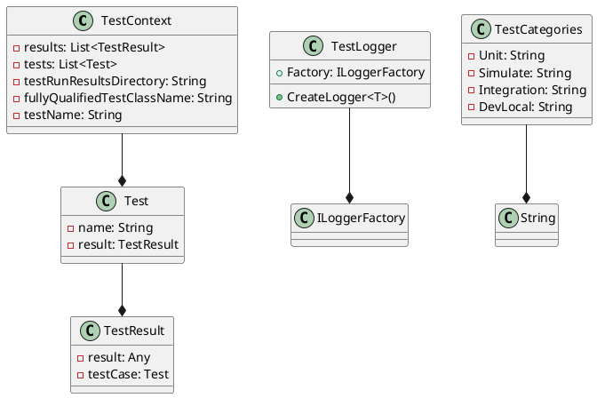
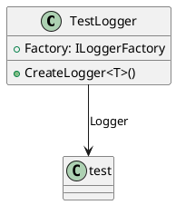

Here is the documentation for the source code files:

**Eliassen.TestUtilities.csproj**

This is a Visual Studio project file for the Eliassen.TestUtilities library. It specifies the project's targets, dependencies, and configurations.

**Readme.TestUtilities.md**

This is the README file for the Eliassen.TestUtilities library. It provides an overview of the library's features and functionalities.

**TestCategories.cs**

This class defines a set of common test categories that can be used to organize and group tests.

**TestContextExtensions.cs**

This static class provides extensions to the `TestContext` class, which is used to customize the behavior of the unit tests.

**GetTestData**

This method retrieves test data from embedded resources and deserializes it into a specified type.

**GetTestDataAsync**

This is an asynchronous version of the `GetTestData` method.

**AddResult**

This method adds a result to the test results for a given test run.

**AddResultFile**

This method adds a file to the test results for a given test run.

**GetQualifiedTestName**

This method returns a simplified name for the executing test.

**GetTestRunResultFiles**

This method returns a list of files that have been added to the test results for the current test run.

**ResolveTestType**

This method returns the current type from the test context.

**Class Diagram**

Here is a class diagram for the Eliassen.TestUtilities library using PlantUML:

This diagram shows the relationships between the classes in the Eliassen.TestUtilities library, including the `TestContext` class, the `Test` class, the `TestResult` class, the `TestLogger` class, and the `TestCategories` class.

**TestLogger.cs**

This class provides functionality for creating logger instances for testing purposes.

**CreateLogger**

This method creates a logger instance for the specified type.

**Class Diagram**

Here is a class diagram for the TestLogger class using PlantUML:

This diagram shows the relationships between the classes in the TestLogger class, including the `TestLogger` class and the `ILoggerFactory` class.